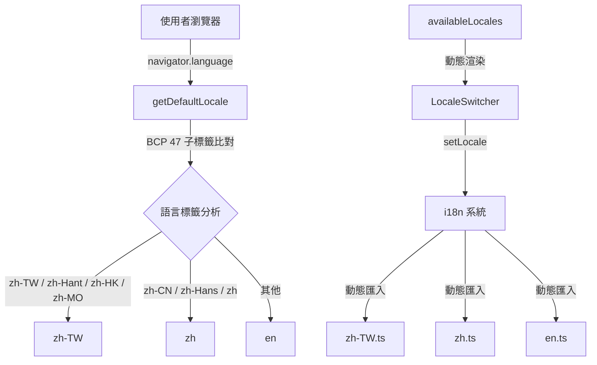

# 設計文件：繁體中文語系支援

## Overview

本設計描述如何為前端應用程式新增繁體中文（zh-TW）語系支援。實作範圍集中於三個主要區域：

1. 建立 `zh-TW.ts` 翻譯檔案（將 `zh.ts` 從簡體中文轉換為繁體中文）
2. 修改 `frontend/src/i18n/index.ts` 以註冊新語系
3. 改進瀏覽器語系偵測邏輯，正確處理 BCP 47 語言子標籤

由於現有的 `LocaleSwitcher` 元件已動態讀取 `availableLocales` 陣列，無需修改任何 UI 元件。

## Architecture



### 影響範圍

| 檔案 | 變更類型 | 說明 |
|------|---------|------|
| `frontend/src/i18n/locales/zh-TW.ts` | 新增 | 繁體中文翻譯檔案 |
| `frontend/src/i18n/index.ts` | 修改 | 型別、載入器、偵測邏輯、語系清單 |

## Components and Interfaces

### 1. 翻譯檔案 `zh-TW.ts`

**路徑：** `frontend/src/i18n/locales/zh-TW.ts`

**設計決策：**
- 以 `zh.ts` 為基礎，將所有簡體中文字元轉換為繁體中文
- 調整台灣地區慣用術語（例：「服务器」→「伺服器」、「信息」→「訊息」、「视频」→「影片」）
- 保持與 `zh.ts` 完全相同的巢狀鍵結構
- 保留所有不應翻譯的英文字串（如 API、Token、Claude Code 等技術名詞）

**台灣用語對照表（主要差異）：**

| 簡體中文（大陸） | 繁體中文（台灣） |
|-----------------|----------------|
| 服务器 | 伺服器 |
| 信息 | 訊息 |
| 视频 | 影片 |
| 文件 | 檔案 |
| 软件 | 軟體 |
| 网络 | 網路 |
| 数据 | 資料 |
| 默认 | 預設 |
| 链接 | 連結 |
| 注册 | 註冊 |
| 账户/账号 | 帳戶/帳號 |
| 用户 | 使用者 |
| 密钥 | 金鑰/密鑰 |
| 仪表盘 | 儀表板 |
| 渠道 | 頻道 |
| 充值 | 加值/儲值 |

### 2. i18n 系統修改 (`index.ts`)

#### 2.1 LocaleCode 型別擴展

```typescript
// 現有
type LocaleCode = 'en' | 'zh'

// 修改為
type LocaleCode = 'en' | 'zh' | 'zh-TW'
```

#### 2.2 localeLoaders 新增

```typescript
const localeLoaders: Record<LocaleCode, () => Promise<{ default: LocaleMessages }>> = {
  en: () => import('./locales/en'),
  zh: () => import('./locales/zh'),
  'zh-TW': () => import('./locales/zh-TW')
}
```

#### 2.3 isLocaleCode() 更新

```typescript
function isLocaleCode(value: string): value is LocaleCode {
  return value === 'en' || value === 'zh' || value === 'zh-TW'
}
```

#### 2.4 getDefaultLocale() 瀏覽器偵測邏輯改進

**設計決策：**
- 使用 BCP 47 子標籤精確比對，而非簡單的 `startsWith('zh')`
- `zh-TW`、`zh-Hant`（及其變體如 `zh-Hant-TW`）→ 對應 `'zh-TW'`
- `zh-HK`、`zh-MO` → 對應 `'zh-TW'`（港澳使用繁體中文）
- `zh-CN`、`zh-Hans`（及其變體）→ 對應 `'zh'`
- 僅 `zh`（無子標籤）→ 對應 `'zh'`（預設為簡體）

```typescript
function getDefaultLocale(): LocaleCode {
  const saved = localStorage.getItem(LOCALE_KEY)
  if (saved && isLocaleCode(saved)) {
    return saved
  }

  const browserLang = navigator.language.toLowerCase()
  
  if (browserLang.startsWith('zh')) {
    // 繁體中文區域：台灣、香港、澳門、Hant 腳本子標籤
    if (
      browserLang === 'zh-tw' ||
      browserLang === 'zh-hk' ||
      browserLang === 'zh-mo' ||
      browserLang.startsWith('zh-hant')
    ) {
      return 'zh-TW'
    }
    // 其餘中文（zh、zh-CN、zh-Hans 等）歸為簡體
    return 'zh'
  }

  return DEFAULT_LOCALE
}
```

**邏輯說明：**
- `navigator.language` 回傳的值遵循 BCP 47 格式（如 `zh-TW`、`zh-Hant-HK`）
- 先以 `toLowerCase()` 標準化後再比對
- 繁體判斷優先（先檢查繁體區域標籤），其餘中文一律歸簡體
- 此邏輯順序確保 `zh-Hant-CN` 這類罕見標籤也能正確對應繁體

#### 2.5 availableLocales 陣列更新

```typescript
export const availableLocales = [
  { code: 'en', name: 'English', flag: '🇺🇸' },
  { code: 'zh', name: '中文', flag: '🇨🇳' },
  { code: 'zh-TW', name: '繁體中文', flag: '🇹🇼' }
] as const
```

## Data Models

本功能不涉及後端資料模型變更。前端相關的資料結構：

### LocaleEntry 型別（隱式）

```typescript
interface LocaleEntry {
  code: LocaleCode
  name: string
  flag: string
}
```

### 翻譯訊息結構

`zh-TW.ts` 的匯出物件必須與 `zh.ts` 具有完全相同的巢狀鍵結構。頂層鍵包括：

- `home` — 首頁
- `keyUsage` — API 金鑰用量查詢
- `setup` — 安裝精靈
- `common` — 通用文字
- `nav` — 導航列
- `auth` — 認證相關
- `dashboard` — 儀表板
- `keys` — API 金鑰管理
- `usage` — 使用記錄
- `redeem` — 兌換碼
- `profile` — 個人設定
- 其他所有現有頂層鍵

## Error Handling

| 情境 | 處理方式 |
|------|---------|
| zh-TW.ts 載入失敗 | vue-i18n 的 `fallbackLocale` 機制自動回退至英文 |
| zh-TW.ts 缺少某翻譯鍵 | vue-i18n 自動使用 `fallbackLocale`（英文）對應值 |
| localStorage 中存有無效語系代碼 | `isLocaleCode()` 守衛回傳 false，使用預設語系 |
| 瀏覽器不支援 `navigator.language` | 回退至 `DEFAULT_LOCALE`（英文） |

## Testing Strategy

### PBT 適用性評估

本功能**不適用**屬性基礎測試（Property-Based Testing）。原因：

- 主要工作為建立靜態翻譯檔案（配置/內容類變更）
- 語系偵測邏輯的有效輸入集合小且明確（BCP 47 中文相關標籤數量有限）
- 不存在「對所有輸入 X，屬性 P(X) 成立」的有意義通用量化命題
- 無解析器、序列化器或資料轉換邏輯需要驗證

### 測試方案

#### 單元測試（Example-Based）

1. **`isLocaleCode()` 函數測試**
   - 輸入 `'zh-TW'` 回傳 `true`
   - 輸入 `'zh-tw'`（小寫）回傳 `false`（大小寫敏感）
   - 輸入 `'ja'` 回傳 `false`

2. **`getDefaultLocale()` 瀏覽器偵測測試**
   - `navigator.language = 'zh-TW'` → 回傳 `'zh-TW'`
   - `navigator.language = 'zh-Hant'` → 回傳 `'zh-TW'`
   - `navigator.language = 'zh-Hant-TW'` → 回傳 `'zh-TW'`
   - `navigator.language = 'zh-HK'` → 回傳 `'zh-TW'`
   - `navigator.language = 'zh-MO'` → 回傳 `'zh-TW'`
   - `navigator.language = 'zh-CN'` → 回傳 `'zh'`
   - `navigator.language = 'zh-Hans'` → 回傳 `'zh'`
   - `navigator.language = 'zh'` → 回傳 `'zh'`
   - `navigator.language = 'en-US'` → 回傳 `'en'`
   - localStorage 已存 `'zh-TW'` → 回傳 `'zh-TW'`（優先於瀏覽器偵測）

3. **翻譯檔案結構一致性測試**
   - 比較 `zh-TW.ts` 與 `zh.ts` 的所有巢狀鍵（遞迴）完全一致
   - 比較 `zh-TW.ts` 與 `en.ts` 的頂層鍵數量相同

4. **`availableLocales` 配置測試**
   - 驗證陣列包含 `{ code: 'zh-TW', name: '繁體中文', flag: '🇹🇼' }`

#### 整合測試

1. **語系切換流程**
   - 呼叫 `setLocale('zh-TW')` 後，`i18n.global.locale.value` 為 `'zh-TW'`
   - localStorage 中 `sub2api_locale` 值為 `'zh-TW'`
   - `document.documentElement.lang` 屬性為 `'zh-TW'`

2. **回退機制**
   - 當 zh-TW 翻譯缺少某鍵時，顯示英文回退值
